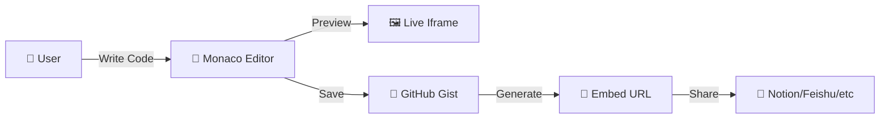
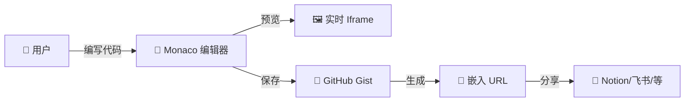

# Notion Artifacts

<div align="center">

**A web-based code editor for creating embeddable interactive components.**  
**为文档平台设计的交互组件编辑器。**

🔗 **Live Demo**: [https://notionartifacts.vercel.app](https://notionartifacts.vercel.app)

[](https://vercel.com/new/clone?repository-url=https%3A%2F%2Fgithub.com%2FObliviateRickLin%2Fnotionartifacts)
[](https://opensource.org/licenses/MIT)
[](https://nextjs.org/)
[](https://www.typescriptlang.org/)

[English](#english) | [中文](#chinese)

</div>

---

<a name="english"></a>
## 🇬🇧 English

Notion Artifacts is an open-source web application that enables users to write, store, and embed interactive HTML/CSS/JS components into note-taking platforms. **The core use case is embedding applications generated by Gemini Canvas (such as interactive visualizations, mini-games, or custom widgets) directly into your Notion pages to enrich your notes.** Originally designed for Notion, it now supports a wide range of platforms through standard web embedding protocols.

### ✨ Core Features

- 🎨 **Live Preview Editor**: Monaco-based code editor with real-time rendering
- 💾 **GitHub Gist Integration**: Persistent storage using your GitHub account
- 🌐 **Universal Embed Support**: Clean URLs compatible with multiple platforms
- 🔒 **Client-Side Architecture**: No backend required; tokens stored locally
- 🚀 **Self-Hostable**: Deploy to your own infrastructure via Vercel or similar platforms

### 🎯 Platform Compatibility

<table>
<tr>
<td width="50%">

**✅ Tested & Working**
- ✓ Notion (via `/embed` block)
- ✓ Feishu / Lark (飞书)
- ✓ Obsidian (iframe syntax)
- ✓ Logseq (iframe embedding)
- ✓ Wolai / FlowUs (embed blocks)
- ✓ Personal websites (standard iframe)

</td>
<td width="50%">

**⚠️ Partial Support**
- ⚡ WeChat Docs / DingTalk
  - May require plugin development
  - Or enterprise whitelisting
- ⚡ Other platforms with iframe restrictions
  - Functionality depends on CSP policies

</td>
</tr>
</table>

### 🏗️ Technical Architecture



**Workflow:**
1. **Editor**: User writes code in a Monaco-powered editor
2. **Storage**: Code saved as a public GitHub Gist via Octokit API
3. **Renderer**: Clean `/view/[id]` endpoint renders the raw HTML without UI chrome
4. **Embedding**: Share the renderer URL with any platform supporting iframes

### 📂 Project Structure

```text
notionartifacts/
├── app/
│   ├── page.tsx           # Main Editor Interface
│   ├── layout.tsx         # Global Layout & Providers
│   └── view/[id]/         # Clean Embed Renderer
├── components/
│   ├── CodeEditor.tsx     # Monaco Editor Wrapper
│   ├── PreviewWindow.tsx  # Sandboxed Iframe
│   └── ui/                # Shadcn UI Components
├── lib/
│   ├── github.ts          # Gist API Logic
│   └── templates.ts       # Default Templates
└── hooks/
    └── use-local-storage.ts
```

### 🚀 Deployment

#### Production (Vercel)

[](https://vercel.com/new/clone?repository-url=https%3A%2F%2Fgithub.com%2FObliviateRickLin%2Fnotionartifacts)

#### Local Development

```bash
git clone https://github.com/ObliviateRickLin/notionartifacts.git
cd notionartifacts
npm install
npm run dev
```

Open [http://localhost:3000](http://localhost:3000) to see the editor.

### 📖 Usage

1. 🌐 Open the deployed application
2. ⚙️ Configure your GitHub Personal Access Token (Settings icon)
3. ✍️ Write your component code in the editor
4. 💾 Click "Save & Share" to generate an embed URL
5. 📋 Paste the URL into your documentation platform

### 🤝 Contributing

Bug reports and feature requests are tracked via [GitHub Issues](https://github.com/ObliviateRickLin/notionartifacts/issues). Pull requests are reviewed on a rolling basis.

---

<a name="chinese"></a>
## 🇨🇳 中文

Notion Artifacts 是一个开源的 Web 应用，用于编写、存储和嵌入 HTML/CSS/JS 交互组件到各类文档平台。**核心功能是将 Gemini Canvas 生成的各种小应用（如交互式可视化、小游戏、自定义组件）直接嵌入到 Notion 页面中，丰富你的笔记内容。**虽然最初为 Notion 设计，但现已支持多种基于标准 Web 嵌入协议的平台。

### ✨ 核心功能

- 🎨 **实时预览编辑器**: 基于 Monaco 的代码编辑器，支持即时渲染
- 💾 **GitHub Gist 集成**: 使用你的 GitHub 账号持久化存储代码
- 🌐 **通用嵌入协议**: 生成适配多平台的纯净 URL
- 🔒 **客户端架构**: 无需后端服务，Token 本地存储
- 🚀 **可自部署**: 通过 Vercel 等平台部署到自有基础设施

### 🎯 平台兼容性

<table>
<tr>
<td width="50%">

**✅ 已测试可用**
- ✓ Notion (通过 `/embed` 块)
- ✓ 飞书 / Feishu
- ✓ Obsidian (iframe 语法)
- ✓ Logseq (iframe 嵌入)
- ✓ 我来 / 息流 (嵌入块)
- ✓ 个人网站 (标准 iframe)

</td>
<td width="50%">

**⚠️ 部分支持**
- ⚡ 腾讯文档 / 钉钉
  - 可能需要开发插件
  - 或申请企业白名单
- ⚡ 其他限制 iframe 的平台
  - 取决于 CSP 策略

</td>
</tr>
</table>

### 🏗️ 技术架构



**工作流程:**
1. **编辑器**: 用户在 Monaco 编辑器中编写代码
2. **存储**: 通过 Octokit API 将代码保存为公开 GitHub Gist
3. **渲染器**: 纯净的 `/view/[id]` 端点渲染原始 HTML，无 UI 包裹
4. **嵌入**: 将渲染 URL 分享到任何支持 iframe 的平台

### 🚀 部署方式

#### 生产环境 (Vercel)

[](https://vercel.com/new/clone?repository-url=https%3A%2F%2Fgithub.com%2FObliviateRickLin%2Fnotionartifacts)

#### 本地开发

```bash
git clone https://github.com/ObliviateRickLin/notionartifacts.git
cd notionartifacts
npm install
npm run dev
```

打开 [http://localhost:3000](http://localhost:3000) 查看编辑器。

### 📖 使用方法

1. 🌐 打开已部署的应用
2. ⚙️ 配置你的 GitHub Personal Access Token (点击设置图标)
3. ✍️ 在编辑器中编写组件代码
4. 💾 点击 "Save & Share" 生成嵌入 URL
5. 📋 将 URL 粘贴到你的文档平台

### 🤝 参与贡献

缺陷报告和功能请求通过 [GitHub Issues](https://github.com/ObliviateRickLin/notionartifacts/issues) 跟踪。Pull Request 会持续审核。

---

<div align="center">

**Tech Stack**: Next.js · TypeScript · Tailwind CSS · Shadcn UI · Monaco Editor  
**License**: MIT

Made with ❤️ for the Notion & Gemini community

</div>
